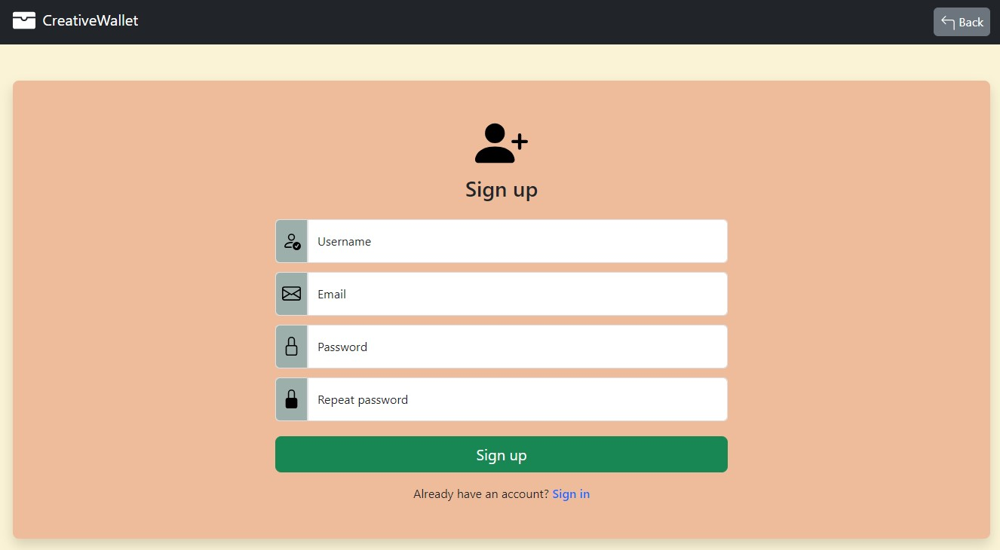

# CreativeWallet - Frontend + Backend

2nd stage of Web Application using basic PHP and SQL language.

## Table of contents

- [Overview](#overview)
  - [About](#about)
  - [Database design](#database-design)
  - [Screenshot](#screenshot)
- [My process](#my-process)
  - [Built with](#built-with)
  - [Useful resources](#useful-resources)

## Overview

### About

CreativeWallet is a web app and a new version of PersonalBudget app written in C++.
Frontend was designed using the Bootstrap library and backend using PHP and SQL.

An application allows you to keep records of your expenses and incomes.
Data are saved to the database (phpMyAdmin).

How does it work?

First create a user account, sign in and then you can add incomes and expenses with today's date or with a selected backdate.
You can show current month's balance, previous month's balance and selected period balance. The application calculates the sum of incomes, expenses and the difference between them (incomes - expenses).

Other functionalities:

- summary of expenses and incomes categories in the tables,
- graphical representation of expenses on a pie chart.

### Database design

[DB project](https://github.com/mateusz-przybyla/CreativeWallet_FE_BE/blob/main/DB_project.pdf)

### Screenshots

- Sign up:\
  

- Adding new income:\
  

- Show balance - list of categories and expenses chart:\
  

## My process

### Built with

Frontend:

- Bootstrap library,
- HTML,
- CSS,
- JavaScript,
- JavaScript Chart library

Backend:

- PHP, PDO library,
- SQL queries,
- MySQL database,
- phpMyAdmin

### Useful resources

- https://miroslawzelent.pl/kurs-php/
- https://miroslawzelent.pl/kurs-mysql/
- https://miroslawzelent.pl/kurs-bootstrap/
- https://getbootstrap.com
- https://www.php.net
- https://canvasjs.com/
- https://www.geeksforgeeks.org
- https://stackoverflow.com
